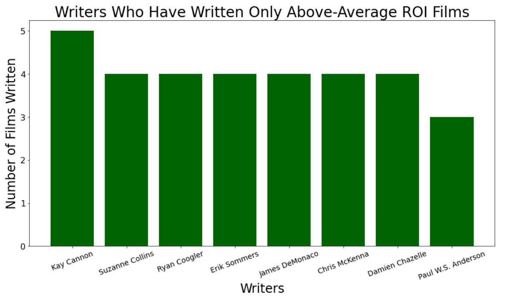

# Title

**Authors**: Drew Holcombe, Raul, Torres, Edward Juarez

## Overview

Microsoft is a well-established technology corporation most known for creating computers and software. Unlike their competitors in the technology industry (Apple, Amazon, etc.), Microsoft does not currently produce original video content. If they were to compete in this medium, what factors would best contribute to their success? We sought out answers using database files from Box Office Mojo, IMDB, TheMovieDB, and The Numbers, which pointed towards certain times of year, genres, and persons associated with reliable financial success.

## Business Problem

If Microsoft were to break into the film industry, what strategy would give them the best chance of success? What types of films are currently doing the best at the box office, and how can we translate this information into actionable items? How can we minimize the risk of potential films becoming box office bombs?

## Data

First, we used data provided by The Numbers. This contains financial information for 5,782 movies, including production budget, domestic gross, and worldwide gross. It also contains their exact release date. Second, we used data from IMDB, which provided the films' genres, as well as the persons involved in their creation (e.g. writers, actors, and directors). By weighing the degree of films' financial success against these variables, we aimed to find what genres, persons, and release dates might impact the box office success of a film.

## Methods

To analyze the genres of films, we snynthesized the genres listed in the database by IMDB with the production budget and worldwide gross provided by The Numbers. Based on the worldwide gross and production budget, we created a ROI value for each film. We then aggregated this ROI value by genre to determine which has the largest potential to earn money. We used the median to avoid over-emphasizing outliers, i.e. massively successful films that don't accurately reflect the overall potential of their genre.

To analyze the potential of actors, writers, and directors, we utilized the persons listed in the database by IMDB and the production budget and worldwide gross provided by The Numbers. We split the films they worked on into two bins: those with above-average ROIs and below-average ROIs. We then analyzed which arists had worked on the highest percentage of films with above-average ROIs in order to determine which artists are most likely to produce a similar result. This ensures the identified artists have a reliable track record of positive results, rather than artists who have worked one or two massive successes.

To analyze time of year of release, we utilized the date of release and financial information from the database provided by The Numbers. By pulling the month from each release date, we were able to aggregate the median ROI from each month and observe patterns that change throughout the year, i.e. what time of year movies are most profitable.

## Results

We found that genres with the highest median ROIs are animation, adventure, and science-fiction. These genres yield a median ROI between 115% and 180%. This indicates that films within these genres are the most likely to yield a strong ROI.


We found that actors, writers, and directors show very different levels of impact on their films' box office performance. Of the writers in our data set, nearly 16% had a perfect track record of writing films with above-average ROIs; this set includes 26 writers who have written three or more films, all with above-average ROIs. For directors, just over 13% had only directed films with above-average ROIs, including 16 directors who had directed three or more films. For actors, less than 3% had only appeared in films with above-average ROIs, only one of whom had appeared in more than two films (Mel Gibson). This indicates that writers and directors are stronger indicators of a film's financial success, while actors are more likely to appear in both high- and low- ROI films.





We found that the months with the highest ROIs for all films are May, June, and July, as well as November. Each of these months has a median ROI of well over 100%. This indicates that films released in these months are the most likely to return a strong ROI. Notably, November is a popular month due to being soon before the deadline for awards season; this results in voters having these films freshest in their minds during voting, making it a popular choice for films targetting awards shows. The months of May, June, and July, meanwhile, seem to be the most popular time to go to movie theatres, causing these films to have higher ROIs than films released in other months.


## Conclusions

Based on our data and results, we believe that a new movie studio should target the high-ROI genres of animation, action, and science-fiction. These films should be produced with writers and directors who have a strong track record of financial success; for animation films, we reccomend Phil Lord and Christopher Miller, known for The Lego Movie and Spider Man: Into the Spider-Verse, and for action and science-fiction, we reccomend Damien Chazelle, best known for Black Panther. For directors, we reccommend Pierre Coffin, best known for the Dispicable Me franchise, for animation films, and Anthony Russo, best known for Avengers: Endgame and Infinity War, for science-fiction and action films. We reccommend these films be released during the summer to target high theatre traffic during those months.

With more time and resources, we would like to research the measures of dispersion of the ROIs of each artists' films. This would either solidify or redirect our observations in this area. This might also identify other artists with strongly consistent ROIs.
We would also like to look into the interaction of these variables. Do certain genres perform especially well during certain months? Do certain artists see their best ROIs in certain genres? Further research would allow us to provide more specific reccomendations that would further facilitate financial growth.

## For More Information

Please review our full analysis in [our Jupyter Notebook](./Microsoft_data_analysis.ipynb) or our [presentation](./movie_studio_presentation.pdf).

For any additional questions or clarification, feel free to contact:
Drew Holcombe: drew.holcombe7@gmail.com
Raul Torres: cassielponce@icloud.com
Edward Juarez: mr.edwardjuarez@gmail.com

## Repository Structure

```
├── README.md                           <- The top-level README for reviewers of this project
├── Microsoft_data_analysis.ipynb      <- Narrative documentation of analysis in Jupyter notebook
├── movie_studio_presentation.pdf       <- PDF version of project presentation
├── zippedData                          <- Zipped data used in our analysis
├── images                              <- Graphs generated from code illustrating our findings
└── Scratch_Code                        <- Working Jupyter Notebooks containing drafts of our data exploration and analysis
```
